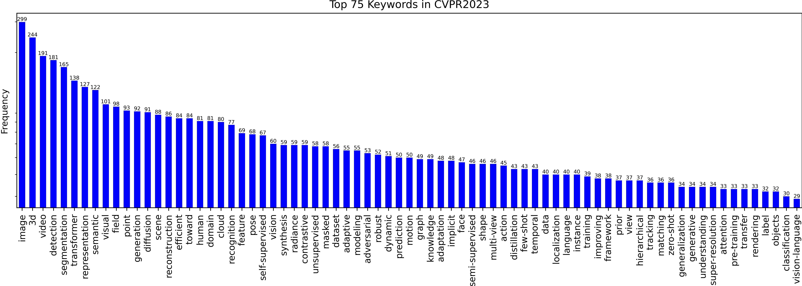
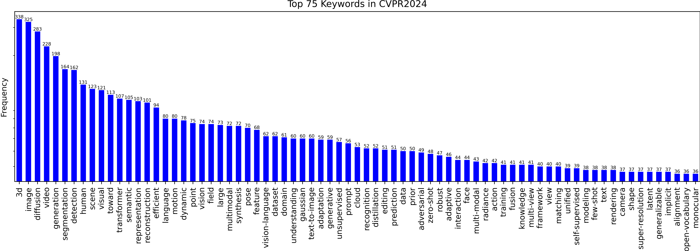

# visualize-accepted-papers

Statistics and Visualization of acceptance information, main keyword of CVPR 2022 accepted papers for the main Computer Vision conferences (CVPR/ICCV/WACV...)

## Usage

```shell
# download the paper information list from the official website
python downloader.py
# visualize the paper information list
python visualizer.py
```

## Results

|    Conference     |        Visualization         |
| :---------------: | :--------------------------: |
| CVPR2021 Keywords |  |
| CVPR2021 Keywords |    |
| CVPR2022 Keywords |  |
| CVPR2022 Keywords |    |
| CVPR2023 Keywords |  |
| CVPR2023 Keywords |    |
| CVPR2024 Keywords |  |
| CVPR2024 Keywords |    |


## Reference

- Inspired by <https://github.com/hoya012/CVPR-2023-Paper-Statistics>
