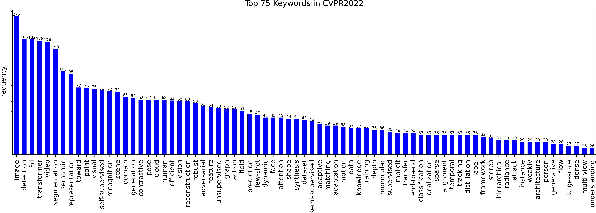
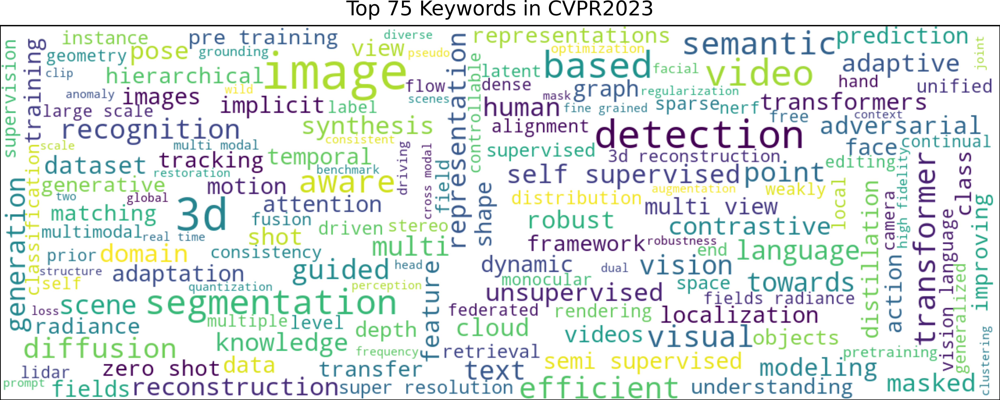
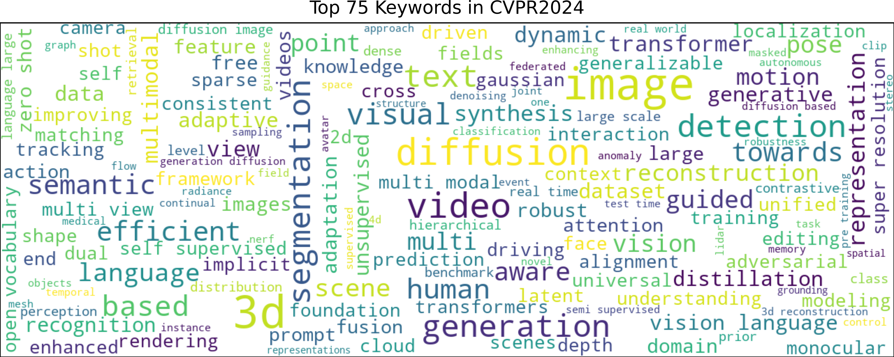

# visualize-accepted-papers

Statistics and Visualization of acceptance information, main keyword of CVPR 2022 accepted papers for the main Computer Vision conferences (CVPR/ICCV/WACV...)

## Usage

```shell
python downloader.py
python visualizer.py
```

## Results

| Conference |          Frequency           |         Word Cloud         |
| :--------: | :--------------------------: | :------------------------: |
|  CVPR2021  |  |  |
|  CVPR2022  |  |  |
|  CVPR2023  |  |  |
|  CVPR2024  |  |  |


## Reference

- Inspired by <https://github.com/hoya012/CVPR-2023-Paper-Statistics>
